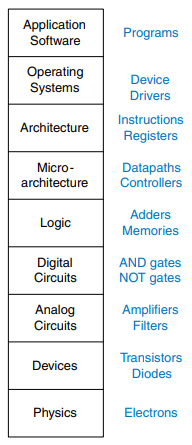

# Introduction

# The Art of Managing Complexity

An important characteristic that separates an engineer or computer scientist from a normal programmer/developer is a systematic approach to managing complexity. Digital systems these days are built from billions of transistors, we would never be able to understand them by writing equations that describe the movement of electrons in a transistor and solving all of these equations simultaneously. The keyword here is abstraction.

## Abstraction

A system can be viewed from many levels of abstraction. Specifically in electronic computing systems we typically distinguish the following levels of abstraction:

In this course we focus on the levels of abstraction from digital circuits through computer architecture. When working on a level of abstraction it is always recommended to have knowledge of the levels just below and above. A computer scientist can not fully optimize code without understanding the architecture for which the program is written.

## Discipline

Discipline is the act of intentionally restricting design choices such that one can work more productively at a higher level of abstraction. Using interchangeable parts is a familiar application of discipline. By limiting our choices to digital circuits we can easily combine components into sophisticated systems that ultimately outperform equivalent systems built using analog components in many applications.

## The three Y’s

Additionally, designers use the three “y’s” to manage complexity:

- *hierarchy*: involves dividing a system into modules, then further subdividing each of these modules until the pieces are easy to understand.
- *modularity*: states that the modules have well-defined functions and interfaces, so that they connect together easily without unanticipated side effects.
- *regularity*: seeks uniformity among the modules. Common modules are reused many times, reducing the number of distinct modules that must be designed.

# The Digital Abstraction

Most physical variables are continuous, especially in the realm of electrical engineering. Digital systems however represent information with *discrete-valued variables*, that is, variables with a finite number of distinct values.

The *amount of information* D in a discrete valued variable with N distinct states is measured in units of *bits* as 

D=log2​N bits.

A binary variable conveys log2​2=1 bit of information. Of course, the word bit is short for binary digit. A continuous signal theoretically contains an infinite amount of information because it can take on an infinite number of values. In practice however, noise and measurement errors limit the information to only 10 to 16 bits for most continuous signals.

# Number Systems

In digital systems, binary or hexadecimal numbers are often more convenient than the base-10 number system.

## Decimal Numbers

Decimal digits are joined together to form longer decimal numbers. Each column of a decimal number has ten times the weight of the previous column. From right to left, the column weight are 1, 10, 100, 1000 and so on. Decimal numbers are referred to as *base* 10. The base is indicated by a subscript after the number to prevent confusion when working in more than one base.

An N-digit decimal number represents one of 10N possibilities: 0,1,2,3,...,10N−1. This is called the *range* of the number.

## Binary Numbers

Bits represent one of two values, 0 or 1, and are joined together to form *binary numbers*. Each column of a binary number has twice the weight of the previous column, so binary numbers are *base 2*. In binary, the column weights are 1, 2, 3, 4, 16, 32, 64, 128 and so on.

An N-bit binary number represents one of 2N possibilities, 0,1,2,3,...,2N−1.

## Hexadecimal Numbers

Writing long binary numbers becomes tedious and prone to error. A group of four bits represents one of 24=16 possibilities. Hence, it is sometimes more convenient to work in *base 16*, called *hexadecimal*. Hexadecimal numbers use the digits 0 to 9 along with the letters A to F. Columns in base 16 have weights of 1,16,162,163 and so on.

### Bytes, Nibbles, Words

A group of eight bits is called a *byte*. It represents one of 28=256 possibilities. A group of four bits, or half a byte, is called a *nibble*. It represents one of 24=16 possibilities. One hexadecimal digit stores one nibble and two hexadecimal digits store one full byte.

Microprocessors handle data in chunks called *words*. The size of a word depends on the architecture of the microprocessor.

Within a group of bits, the bit in the 1’s column is called the *least significant bit (lsb)* and the bit at the other end is called the *most significant bit (msb)*. Within a word, the bytes are identified as *least significant byte (LSB)* through *most significant byte (MSB)*.

By coincidence, 210=1024≈103. Therefore the term *kilo* indicates 210. Similarly, *mega* (million) indicates 220≈106 and *giga* (billion) indicates 230≈109.

1024 bytes is called a *kilobyte* (KB). 1024 bits is called a *kilobit* (Kb or Kbit). Similarly, MB, Mb, GB and Gb are used for millions and billions of bytes and bits. Memory capacity is usually measured in bytes. Communication speed is usually measured in bits/sec.

## Binary Addition

As in decimal addition, if the sum of two numbers is greater than what fits in a single digit, we *carry* a 1 into the next column. The bit that is carried over to the neighboring column is called the *carry bit*.

Digital systems usually operate on a fixed number of digits. Addition is said to *overflow* if the result is too big to fit in the available digits. overflow can be detected by checking for a carry out of the most significant column.

## Signed Binary Numbers

### Sign/Magnitude Numbers

*Sign/magnitude* numbers are intuitively appealing because they match our custom of writing negative numbers with a minus sign followed by the magnitude. An N-bit sign/magnitude number uses the most significant bit as the sign and the remaining N−1 bits as the magnitude (absolute value). A sign bit of 0 indicates positive and a sign bit of 1 indicates negative.

Unfortunately, ordinary binary addition does not work for sign/magnitude numbers. For example, using ordinary addition on −510​+510​ gives 11012​+01012​=100102​, which is nonsense.

An N-bit sign/magnitude number spans the range [−2N−1+1,2N−1−1]. Sign/magnitude numbers are slightly odd in that both +0 and −0 exist. Both indicate zero.

### Two’s Complement Numbers

*Two’s complement* numbers are identical to unsigned binary numbers except that the most significant bit position has a weight of −2N−1 instead of 2N−1. They overcome the shortcomings of sign/magnitude numbers: zero has a single representation, and ordinary addition works.

In two’s complement representation, zero is written as all zeros: 000..02​. The most positive number has a 0 in the most significant position and 1’s elsewhere: 0111111...12​. The most negative number has a 1 in the most significant position and o’s elsewhere: 100000...02​=−2N−1. -1 is written as all ones: 1111...12​.

The sign of a two’s complement number is reversed in a process called *taking the two’s complement*. The process consists of inverting all of the bits in the number, then adding 1 to the least significant bit position. This is useful to find the representation of a negative number or to determine the magnitude of a negative number.

Two’s complement numbers have the advantage that addition works properly for both positive and negative numbers. Recall that when adding N-bit numbers, the carry out of the Nth bit is discarded.

Subtraction is performed by taking the two’s complement of the second number, then adding.

Unlike the sign/magnitude system, the two’s complement system has no separate -0.

In general, the range of an N-bit two’s complement number spans [−2N−1,2N−1−1]. It should make sense that there is one more negative number than positive number because there is no -0.

The most negative number 100...0002​=−2N−1 is sometimes called the *weird number*. Its two’s complement is found by inverting the bits (producing 01...1112​) and adding 1, which produces 10...0002​, the weird number, again. Hence, this negative number has no positive counterpart.

Adding two N-bit positive numbers or negative numbers may cause overflow if the result is greater than 2N−1−1 or less than −2N−1. Adding a positive number to a negative number never causes overflow. Unlike signed numbers, a carry out of the most significant column does not indicate overflow. Instead, overflow occurs if the two numbers being added have the same sign bit and the result has the opposite sign bit.

When a two’s complement number is extended to more bits, the sign bit must be copied into the most significant bit positions. This process is called *sign extension*. For example the numbers 3 and -3 are written as 4-bit two’s complement numbers 0011 and 1101 respectively. They are sign-extended to seven bits by copying the sign bit into the three new upper bits to form 0000011 and 1111101 respectively.

# Logic Gates

*Logic gates* are simple digital circuits that take one or more binary inputs and produce a binary output. Logic gates are drawn with a symbol showing the input (or inputs) and the output. Inputs are usually drawn to the left (or top) and outputs on the right (or bottom). Digital designers typically use letters near the beginning of the alphabet for gate inputs and the letter Y for the gate output. The relationship between the inputs and the output can be described with a truth table or a boolean equation. A *truth table* lists inputs on the left and the corresponding output on the right. It has one row for each possible combination of inputs. A *Boolean equation* is a mathematical expression using binary variables.

## NOT Gate

A NOT gate has one input, A, and one output, Y, as shown.

The NOT gate’s output is the inverse of its input. If A is FALSE, then Y is TRUE. If A is TRUE, then Y is FALSE. This relationship is summarized by the truth table and boolean equation in the figure. This gate is also called an *inverter*.

## Buffer

The other one-input logic gate is called a *buffer* as shown. From the logical point of view, a buffer is no different from a wire, so it might seem useless. However, from the analog point of view, the buffer might have desirable characteristics such as the ability to deliver large amounts of current to a motor, or the ability to quickly send its output to many gates. This is an example of why we need to consider multiple levels of abstraction to fully understand a system; the digital abstraction hides the real purpose of a buffer.

The triangle symbol indicates a buffer. A circle on the output is called a *bubble* and indicates inversion, as was seen in the NOT gate symbol.

## AND Gate

Two-input logic gates are more interesting. The AND gate as shown produces a TRUE output Y if and only if both A and B are TRUE. Otherwise, the output is FALSE. By convention, the inputs are listed in the order you would count up in binary.

The Boolean equation for an AND gate can be written in several ways: Y=A∙B, Y=AB or Y=A∩B.

## OR Gate

The OR gate as shown produces a TRUE output Y, if either A or B (or both) are TRUE.

The Boolean equation for an OR gate is written as Y=A+B or Y=A∪B.

## Other Two-Input Gates

## Multiple-Input Gates

Many Boolean functions of three or more inputs exist. The most common are AND, OR, XOR, NAND, NOR and XNOR. An N-input AND gate produces a TRUE output when all N inputs are TRUE. An N-input OR gate produces a TRUE output when at least one input is TRUE. An N-input XOR gate is sometimes called a *parity* gate and produces a TRUE output if an odd number of inputs are TRUE.

# Beneath the Digital Abstraction

A digital system uses discrete-valued variables. However, the variables are represented by continuous physical quantities such as the voltage on a wire, the position of a gear, or the level of fluid in a cylinder. hence, the designer must choose a way to relate the continuous variable to the discrete variable.

For example, consider representing a binary signal A with a voltage on a wire. Let 0 volts (V) indicate A=0 and 5 V indicate A=1. Any real system must tolerate some noise, so 4.97 V probably ought to be interpreted as A=1 as well. But what about 4.3 V? or 2.8 V?

## Supply Voltage

Suppose the lowest voltage in the system is 0 V, also called *ground* or GND. The highest voltage in the system comes from the power supply and is usually called VDD​. In 1970’s and 1980’s technology, VDD​ was generally 5 V. As chips have progressed to smaller transistors, VDD​ has dropped to 3.3 V, 2.5 V, 1.8 V, 1.5 V, 1.2 V or even lower to save power and avoid overloading the transistors.

## Logic Levels

The mapping of a continuous variable onto a discrete binary variable is done by defining *logic levels*, as shown.

The first gate is called the *driver* and the second gate is called the *receiver*. The output of the driver is connected to the input of the receiver. The driver produces a LOW (0) output in the range of 0 to VOL​ or a HIGH (1) output in the range of VOH​ to VDD​.

If the receiver gets an input in the range of 0 to VIL​, it will consider the input to be LOW. If the receiver gets an input in the range of VIH​ to VDD​, it will consider the input to be HIGH. If for some reason such as noise or faulty components, the receiver’s input should fall in the *forbidden zone* between VIL​ and VIH​, the behavior of the gate is unpredictable. VOH​,VOL​,VIH​ and VIL​ are called the output and input high and low logic levels.

## Noise Margins

Of course, the input and output levels must be chosen such that VOL​&lt;VIL​ and VOH​&gt;VIH​, otherwise the input of the receiver can not possibly be interpreted in a correct way. Thus, even if the output of the driver is contaminated by some noise, the input of the receiver will still detect the correct logic level. The *noise margin* is the amount of noise that could be added to a worst-case output such that the signal can still be interpreted as a valid input: 

NML​NMH​​=VIL​−VOL​=VOH​−VIL​​

## DC Transfer Characteristics

The *DC transfer characteristics* of a gate describe the output voltage as a function of the input voltage when the input is changed slowly enough that the output can keep up. They are called transfer characteristics because they describe the relationship between input and output voltages.

An ideal inverter would have an abrupt switching threshold at 2VDD​​ as shown on the left.

A real inverter changes more gradually between the extremes, as shown on the right. When the input voltage V(A) is 0, the output voltage V(Y)=VDD​. When V(A)=VDD​, V(Y)=0. However, the transition between these endpoints is smooth and may not be centered at exactly 2VDD​​. This raises the question of how to define the logic levels.

A reasonable place to choose the logic levels is where the slope of the transfer characteristic dV(A)dV(Y)​ is -1. These two points are called the *unity gain points*. Choosing logic levels at unity gain points usually maximizes the noise margins. If VIL​ were reduced, VOH​ would only increase by a small amount. But if VIL​ were increased, VOH​ would drop precipitously.

## The Static Discipline

To avoid inputs falling into the forbidden zone, digital logic gates are designed to conform to the *static discipline*. The static discipline requires that, given logically valid inputs, every circuit element will produce logically valid outputs. By conforming to the static discipline, digital designers sacrifice the freedom of using arbitrary analog circuit elements in return for the simplicity and robustness of digital circuits. They raise the level of abstraction from analog to digital, increasing design productivity by hiding needless detail.

The choice of VDD​ and logic levels is arbitrary, but all gates that communicate must have compatible logic levels. Therefore, gates are grouped into *logic families* such that all gates in a logic family obey the static discipline when used with other gates in the family.

Four major logic families that predominated from the 1970’s through the 1990’s are *Transistor-Transistor Logic (TTL), Complementary Metal-Oxide-Semiconductor Logic (CMOS), Low Voltage TTL Logic (LVTTL)*, and *Low Voltage CMOS Logic (LVCMOS)*. Since then, logic families have balkanized with a profliferation of even lower power supply voltages.

# CMOS Transistors

Modern computers use transistors because they are reliable, small and cheap.. *Transistors* are electrically controlled switches that turn ON or OFF when a voltage or current is applied to a control terminal. The two main types of transistors are *bipolar transistors* and *metal-oxide-semiconductor field effect transistors (MOSFETs)*.

MOSFETs are now the building blocks of almost all digital systems.

## Semiconductors

MOSFETs are built from silicon, the predominant atom in rock and sand. Silicon (Si) is a group IV element, so it has four electrons in its valence shell and forms bonds with four adjacent atoms, resulting in a crystalline lattice.

By itself, silicone is a poor conductor because all the electrons are tied up in covalent bonds. However, it becomes a better conductor when small amounts of impurities, called *dopant* atoms, are carefully added. If a group V dopant such as arsenic (As) is added, the dopant atoms have an extra electron that is not involved in the bonds and can therefore move about the lattice freely, leaving an ionized dopant atom (As+) behind. The electron carries a negative charse, so we call arsenic an *n-type* dopant. On the other hand, if a group III dopant such as boron (B) is addedm the dopant atoms are missing an electron. This missing electron is called a *hole*. An electron from a neighboring silicon atom may mmove over to fill the missing bond, forming an ionized dopant atom (B-) and leaving a hole at the neighboring silicon atom. In a similar fashion, the hole can migrate around the lattice. The hole is a lack of negative charge, so it acts like a positively charged particle. Hence, we call boron a *p-type* dopant. Because the conductivity of silicon changes over many orders of magnitude depending on the concentration of dopants, silicon is called a *semiconductor*.

## Diodes

The junction between p-type and n-type silicon is called a *diode*. The p-type region is called the *anode* and the n-type region is called the *cathode*.

When the voltage on the anode rises above the voltage on the cathode, the diode is *forward biased*, and current flows through the diode from the anode to the cathode. But when the anode voltage is lower than the voltage on the cathode, the diode is *reverse biased*, and no current flows.

## Capacitors

A *capacitor* consists of two conductors separated by an insulator. When a voltage V is applied to one of the conductors, the conductor accumulates electric *charge* Q and the other conductor accumulates the opposite charge −Q, The *capacitance* C of the capacitor is the ratio of charge to voltage: C=VQ​. The capacitance is proportional to the size of the conductors and inversely proportional to the distance between them. 

Capacitance is important, because charging or discharging a conductor takes time and energy. More capacitance means that a circuit will be slower and require more energy to operate.

## nMOS and pMOS Transistors

A MOSFET is a sandwich of several layers of conducting and insulating materials. MOSFETs are built on thin flat *wafers* of silicon of about 15 to 30 cm in diameter. The manufacturing process begins with a bare wafer.The process involves a sequence of steps in which dopants are implanted into the silicon, thin films of silicon dioxide and silicon are grown, and metal is deposited. Between each step, the wafer is *patterned* so that the materials only appear where they are desired. 

Because transistors are a fraction of a micron in length and the entire wafer is processed at once, it is inexpensive to manufacture billions of transistors at a time. Once processing is complete, the wafer is cut into rectangles called chips or dice that contain thousands, millions, or even billions of transistors. The chip is tested, then placed in a plastic or ceramic package with metal pins to connect it to a circuit board.

The MOSFET sandwich consists of a conducting layer called the *gate* on top of an insulating layer of *silicone dioxide* (SiO2) on top of the silicon wafer, called the *substrate*. Historically, the gate was constructed from metal, hence the name metal-oxide-semiconductor. modern manufacturing processes use polycrystalline silicon for the gate, because it does not melt during subsequent high-temperature processing steps. Silicon dioxide is better known as glass and is often simply called *oxide* in the semiconductor industry. The metal-oxide-semiconductor sandwich forms a capacitor, in which a thin layer of insulating oxide called a *dielectric* separates the metal and semiconductor plates.

There are two flavors of MOSFETs: nMOS and pMOS. The n-type transistors, called nMOS, have regions of n-type dopants adjacent to the gate called the *source* and the *drain* and are built on a p-type semiconductor substrate. The pMOS transistory are just the opposite, consisting of p-type source and drain regions in an n-type substrate.

A MOSFET behaves as a voltage-controlled switch in which the gate voltage creates an electric field that turns ON or OFF a connection between the source and drain. The term *field effect transistor* comes from this principle of operation.

The substrate of an nMOS transistor is normally tied to GND. Consider the situation when the gate is also at 0 V, as shown. The diodes between the source or drain and the substrate are reverse biased because the source or drain voltage is nonnegative. Hence, there is no path for current to flow between the source and drain, so the transistor is OFF. Consider the situation when the gate is tied to VDD​. as shown. When a positive voltage is applied to the top plate of a capacitor, it establishes an electric field that attracts positive charge on the top plate and negative charge to the bottom plate. If the voltage is sufficiently large, so much negative charge is attracted to the underside of the gate that the region *inverts* from p-type to effectively become n-type. This inverted region is called the *channel*. Now the transistor has a continuous path from the n-type source through the n-type channel to the n-type drain, so electrons can flow from source to drain. The transistor is ON. The gate voltage required to turn on a transistor is called the *threshold voltage*, Vt​, and is typically 0.3 to 0.7 V.

pMOS transistors work just the opposite way. The substrate is tied to VDD​. When the gate is also at VDD​, the pMOS transistor is OFF. When the gate is at GND, the channel inverts to p-type and the pMOS transistor is ON.

However, MOSFETs are not perfect switches. nMOS transistors are excellent at passing 0’s, but very poor at passing 1’s. Specifically, when the gate of an nMOS transistor is at VDD​, the drain will only swing between 0 and VDD​−Vt​. Similarily, pMOS transistory pass 1’s well, but 0’s poorly.

Considering both types of MOSFETs require both types of substrate, manufacturing processes typically start with a p-type wafer, then implant n-type regions called *wells* where the pMOS transistory will go. These processes that provide both flavors of transistors are called Complementary MOS, or CMOS. CMOS processes are used to build the vast majority of all transistors fabricated today.

To summarize, CMOS processes give us two types of electrically controlled switches, as shown. The voltage at the gate (g) regulates the flow of current between the source (s) and drain (d). nMOS transistors are OFF when the gate is 0 and ON when the gate is 1. pMOS transistors are ON when the gate is 0 and OFF when the gate is 1.

## CMOS NOT Gate

The triangle indicates GND, the flat bar indicates VDD​. The nMOS transistor, N1, is conneected between GND and the Y output. The pMOS transistor, P1, is connected between VDD​ and the Y output. Both transistor gates are controlled by the input, A.

If A=0, N1 is OFF and P1 is ON. Hence, Y is connected to VDD​ but not to GND, and is pulled up to a logic 1. P1 passes a good 1. If A=1, N1 is ON and P1 is OFF, and Y is pulled down to a logic 0. N1 passes a good 0.

## Other CMOS Logic Gates

A two-input NAND gate is displayed. In schematic diagrams, wires are always joined at three-way junctions. They are joined at four-way junctions only if a dot is shown. The nMOS transistors N1 and N2 are connected in series; both nMOS transistors must be ON to pull the output down to GND. The pMOS transistors P1 and P2 are in parallel; only one pMOS transistor must be ON to pull the output up to VDD​.

The figure shows a general form to construct any inverting logic gate, such as NOT, NAND or NOR. nMOS transistors are good at passing 0’s, so a pull-down network of nMOS transistors is places between the output and GND to pull the output down to 0. pMOS transistors are good at passing 1’s, so a pull-up network of pMOS transistors is placed between the output and VDD​ to pull the output up to 1. The networks may consist of transistors in series or in parallel. When transistors are in parallel, the network is ON if either transistor is ON. When transistors are in series, the network is ON only if both transistors are ON. The slash across the input wire indicates that the gate may receive multiple inputs.

If both the pull-up and pull-down networks were ON simultaneously, a *short circuit* would exists between VDD​ and GND. The output of the gate might be in the forbidden zone and the transistors would consume large amounts of power, possibly enough to burn out. On the other hand, if both the pull-up and pull-down networks were OFF simultaneously, the output would be connected to neither VDD​ nor GND. We say that the output *floats*. Its value is again undefined. Floating outputs are usually undesirable, but in some cases they can be used to the designer’s advantage.

In a properly functioning logic gate, one of the networks should be ON and the other OFF at any given time, so that the output is pulled HIGH or LOW but never shorted or floating. We can guarantee this by using the rule of *conduction complements*. When nMOS transistors are in series, the pMOS transistors must be in parallel. When nMOS transistors are in parallel, the pMOS transistors must be in series.

## Transmission Gates

Recall that nMOS transistors are good at passing 0 and pMOS transistors are good at passing 1, so the parallel combination of the two passes both values well. This is what’s called a *transmission gate* or *pass gate*. The control signals are called *enables*, EN and EN. 

## Pseudo-nMOS Logic

An N-input CMOS NOR gate uses N nMOS transistors in parallel and N pMOS transistors in series. Transistors in series are slower than transistors in parallel, just as resistors in series have more resistance than resistors in parallel. Moreover, pMOS transistors are slower than nMOS transistors because holes cannot move around the silicon lattice as fast as electrons. Therefore the parallel nMOS transistors are fast and the series pMOS transistors are slow.

Pseudo-nMOS logic replaces the slow stack of pMOS transistors with a single weak pMOS transistor that is always ON, as shown. This pMOS transistor is often called a *weak pull-up*. The physical dimensions of the pMOS transistor are selected so that the pMOS transistor will pull the output, Y, HIGH weakly - that is, only if none of the nMOS transistors are ON. But if any nMOS transistor is ON, it overpowers the weak pull-up and pulls Y down close enough to GND to produce a logic 0.

The advantage of pseudo-nMOS logic is that it can be used to build fast NOR gates with many inputs. For example, as shown, a pseudo-nMOS four-input NOR gate. Pseudo-nMOS gates are useful for certain memory and logic arrays discussed later. The disadvantage is that a short circuit exists between VDD​ and GND when the output is LOW; the weak pMOS and nMOS transistors are both ON. The short circuit draws continuous power, so pseudo-nMOS logic must be used sparingly.

## Power Consumption

*Power consumption* is the amount of energy used per unit time. Digital systems draw both *dynamic* and *static* power. Dynamic power is the power used to charge capacitance as signals change between 0 and 1. Static power is the power used even when signals do not change and the system is idle.

Logic gates and the wires that connect them have capacitance. The energy drawn from the power supply to charge a capacitance C to voltage VDD​ is CVDD2​. If the voltage on the capacitor switches at frequency f, it charges the capacitor 2f​ times and discharges it 2f​ times per second. Discharging does not draw energy from the power supply, so the dynamic power consumption is 

Pdynamic​=21​CVDD2​f.

Electrical systems draw some current even when they are idle. When transistors are OFF, they leak a small amount of current. Some circuits, such as the pseudo-nMOS gate, have a path from VDD​ to GND through which current flows continuously. The total static current, IDD​, is also called the *leakage current* or the *quiescent supply current* flowing between VDD​ and GND. The static power consumption is proportional to this static current: 

Pstatic​=IDD​VDD​.